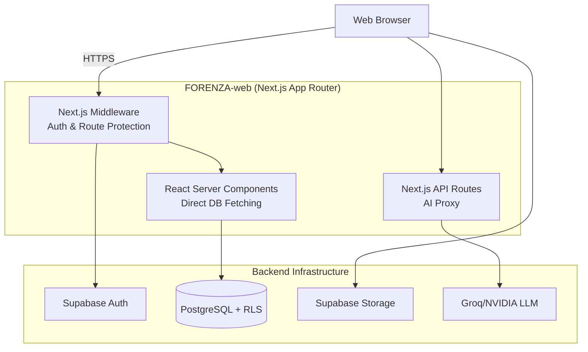

<div align="center">
  
  <h1>FORENZA Web Application</h1>
  <p><strong>Secure Evidence. Verified Chain. Defensible Truth.</strong></p>

  <p>
    <a href="#architecture"></a>
    <a href="#security"></a>
    <a href="#database"></a>
    <a href="#ai"></a>
  </p>
</div>

---

## 📖 Overview
**FORENZA** is an Enterprise Forensic Evidence Platform designed to bridge the gap between field investigation and courtroom validation. 

This repository contains the **FORENZA Web Application**, an administrative, investigative, and judicial counterpart to the mobile field app. It provides secure, role-based dashboards for managing the entire lifecycle of digital and physical evidence.

> [!CAUTION]
> **LOCAL DEVELOPMENT ONLY:** This project is currently configured for academic demonstration and local testing. Do NOT deploy to production without executing the security checklists found in the `docs/` directory.

---

## 🏛️ System Architecture

The web application utilizes a Serverless React architecture via Next.js (App Router), delegating database persistence and Row-Level Security (RLS) to Supabase.



---

## 🔐 7-Role RBAC System

FORENZA enforces strict data compartmentalization based on 7 distinct user roles. Access is controlled both via the Next.js `middleware.ts` (UI routing) and Supabase RLS (Data Access).

| Role | Primary Responsibility | Workspace |
|------|------------------------|-----------|
| **Investigating Officer** | Case creation, evidence capture | `/officer` |
| **Vault Custodian** | Physical evidence storage | `/vault` |
| **Forensic Laboratory** | Sample analysis & reporting | `/lab` |
| **Supervisor** | Investigation oversight & overrides | `/supervisor` |
| **Judicial Chamber** | Evidence verification & dossiers | `/judge` |
| **Compliance Officer** | Audit logs & security events | `/auditor` |
| **System Administrator** | User & device management | `/admin` |

*For the complete granular permission matrix, see [`docs/WEBSITE_RBAC_PERMISSION_MATRIX.md`](docs/WEBSITE_RBAC_PERMISSION_MATRIX.md).*

---

## 🔗 Key Capabilities

### 1. Cryptographic Verification
Evidence integrity is paramount. FORENZA utilizes SHA-256 hashing at the point of capture (via the Android App). The web platform verifies this hash against the stored binary to instantly flag tampering.

### 2. Immutable Chain of Custody
Every transfer of evidence requires a secure handshake (QR/NFC). The web platform visualizes this lineage, tracing the evidence from the crime scene, through the vault, into the lab, and finally to the courtroom.

### 3. AI-Assisted Forensics
The platform integrates with Groq/NVIDIA LLMs to assist officers with object classification and metadata extraction. 
> [!WARNING]
> All AI output is strictly labeled as **AI-ASSISTED** and requires human confirmation. The AI is a tool, not an authority.

---

## 🛠️ Local Development Setup

To run the platform locally for demonstration:

1. **Install Dependencies:**
   ```bash
   npm install
   ```
2. **Configure Environment:**
   Copy `.env.example` to `.env.local` and populate the keys.
   *(Requires Supabase and MapTiler configurations)*
3. **Run Development Server:**
   ```bash
   npm run dev
   ```

---

## 📚 Comprehensive Documentation

The `docs/` folder contains professional, detailed documentation of the system's architecture, security, and algorithms.

👉 **[Enter the Documentation Portal](docs/README.md)** 👈

Or access specific guides directly:
- [Developer Handover](docs/DEVELOPER_HANDOVER.md)
- [System Architecture](docs/architecture/SYSTEM_ARCHITECTURE.md)
- [Security & RBAC](docs/security/SECURITY.md)
- [Local Development](docs/development/LOCAL_DEVELOPMENT.md)

---

## 📜 License

FORENZA is released under the MIT License.

See the `LICENSE` file for details.

<div align="center">
  <p><em>Developed for Academic Demonstration & Future Deployment</em></p>
</div>
