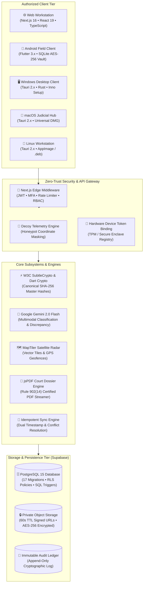
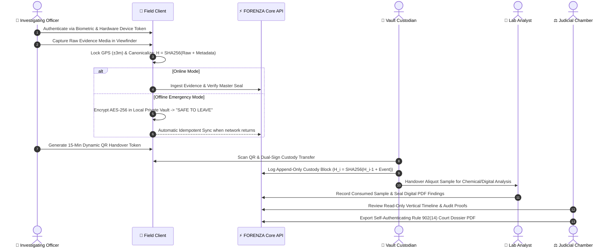

# 🛡️ FORENZA — Enterprise Forensic Evidence Platform
### *Secure Evidence. Verified Chain. Defensible Truth.*

[](https://github.com/Ti838/FORENZA)
[-blue?style=for-the-badge&logo=vitest)](https://github.com/Ti838/FORENZA)
[](https://github.com/Ti838/FORENZA)
[](https://github.com/Ti838/FORENZA)
[](https://supabase.com)
[](https://ai.google.dev)

---

## 📌 Executive Summary

**FORENZA** is an enterprise-grade digital and physical evidence chain-of-custody, cryptographic verification, and judicial review platform. Built for law-enforcement agencies, forensic science laboratories, and judicial chambers, FORENZA provides mathematically verifiable guarantees against evidence tampering, retroactive record alteration, and broken custody chains.

Designed with reference to internationally recognized standards:
* **ISO/IEC 27037:2012** — Guidelines for identification, collection, acquisition, and preservation of digital evidence.
* **ISO/IEC 27038:2014** — Specification for digital redaction.
* **NIST SP 800-86** — Guide to Integrating Forensic Techniques into Incident Response.
* **UNODC & Budapest Convention** aligned cyber-forensic chain of custody protocols.

---

## 🏛️ System Architecture Topology

FORENZA operates on a unified core architecture connecting 5 authorized native client applications to an append-only PostgreSQL database, W3C SubtleCrypto SHA-256 ledger, and private cloud storage buckets.



---

## 🔄 9-Stage Evidentiary Lifecycle

Every physical and digital item follows an immutable 9-step state machine from crime-scene acquisition to courtroom trial:



---

## ⚡ Multi-Platform Capability Matrix

FORENZA does not wrap websites inside WebViews. It provides native, platform-optimized applications sharing the same cryptographic backend:

| Feature / Capability | Android (Mobile) | Windows Desktop | macOS Desktop | Linux Desktop | Web Workstation |
|---|:---:|:---:|:---:|:---:|:---:|
| **Authentication & MFA** | ✅ Full | ✅ Full | ✅ Full | ✅ Full | ✅ Full |
| **7-Tier Role Access Control (RBAC)** | ✅ Full | ✅ Full | ✅ Full | ✅ Full | ✅ Full |
| **Hardware Camera Viewfinder** | 📸 Native Hardware | 📸 Supported | 📸 Supported | 📸 Supported | 📸 Web API |
| **Hardware GPS & 500m Geofence** | 📍 Native GPS Sensor | 📍 OS Location | 📍 OS Location | 📍 OS Location | 📍 Browser API |
| **Offline-First AES-256 Vault** | ⚡ Full Native Vault | ⚡ Local Secure | ⚡ Local Secure | ⚡ Local Secure | ⚡ PWA Cache |
| **Single-Use QR Handover Tokens** | 📷 Native Scanner | 🖥️ Display / Gen | 🖥️ Display / Gen | 🖥️ Display / Gen | 🖥️ Display / Gen |
| **Transit Telemetry & Decoy Defense** | 📡 Live Broadcast | 🗺️ Satellite HUD | 🗺️ Satellite HUD | 🗺️ Satellite HUD | 🗺️ Satellite HUD |
| **Lab Sample Depletion Tracking** | 🔬 Intake / View | 🔬 Full Desk | 🔬 Full Desk | 🔬 Full Desk | 🔬 Full Desk |
| **Judicial Timeline & Dossier Export** | ⚖️ View Only | 📜 Full jsPDF | 📜 Full jsPDF | 📜 Full jsPDF | 📜 Full jsPDF |
| **3-Mode Theme (Light/Dark/Auto)** | 🎨 System / L / D | 🎨 System / L / D | 🎨 System / L / D | 🎨 System / L / D | 🎨 System / L / D |
| **Packaging & Installer** | `.apk` / `.aab` | `.exe` (Inno Setup) | `.dmg` Drag-Drop | `.AppImage` / `.deb` | Cloud Web (Zero-Install) |

---

## 🔐 Cryptographic Integrity & Master Hashing

Evidence integrity is mathematically enforced using deterministic SHA-256 master hashing and recursive custody chains:

### 1. Deterministic Master Evidence Hash
$$H_{\text{master}} = \text{SHA-256}\Big(\text{RawMediaBytes} + \text{EvidenceID} + \text{CaseID} + \text{OfficerID} + \text{GPS}_{\text{lat,lng}} + \text{Timestamp}_{\text{UTC}}\Big)$$

### 2. Recursive Append-Only Custody Chain
$$H_0 = H_{\text{master}}$$
$$H_i = \text{SHA-256}\Big(H_{i-1} + \text{SenderID} + \text{ReceiverID} + \text{Timestamp} + \text{Location} + \text{Action}\Big)$$

If any byte in historical events or media is altered, recursive recalculation fails and flags the record as **`COMPROMISED / TAMPERED`**.

---

## 🗂️ Certified Role Workstations

FORENZA provides 7 segregated operational workstations enforced via PostgreSQL Row Level Security (RLS):

```
┌──────────────────────────────────────┬────────────────────────────────────────────────────────────────────────┐
│ Role Desk                            │ Primary Responsibilities & UI Features                                 │
├──────────────────────────────────────┼────────────────────────────────────────────────────────────────────────┤
│ 1. Investigating Officer (/officer)  │ Camera viewfinder, GPS geofence radar, offline vault, and QR tokens.   │
│ 2. Vault Custodian (/vault)          │ Physical rack/bin indexing, intake barcode scanner, and custody ledger.│
│ 3. Forensic Laboratory (/lab)        │ Scientific aliquot sample depletion, report hash sealing, and AI diff. │
│ 4. Supervisor (/supervisor)          │ Multi-case oversight, officer telemetry tracking, and 500m overrides. │
│ 5. Judicial Chamber (/judge)         │ Read-only vertical timeline, evidence inspection, and Court Dossiers.  │
│ 6. System Administrator (/admin)     │ User RBAC, hardware device token approvals, and master audit ledger.   │
│ 7. Compliance Officer (/auditor)     │ ISO/IEC 27037 & NIST SP 800-86 international compliance dashboards.    │
└──────────────────────────────────────┴────────────────────────────────────────────────────────────────────────┘
```

---

## 🚀 Quick Start & Local Setup

### Prerequisites
* **Node.js**: v18.18.0+ or v20.x+
* **Flutter SDK**: v3.19+ (for Android development)
* **Rust & Cargo**: v1.75+ (for Desktop Tauri builds)
* **Git**

### 1. Clone & Configure Environment
```bash
git clone https://github.com/Ti838/FORENZA.git
cd FORENZA

# Copy environment variables
cp .env.example web/.env.local
```

### 2. Run Web Platform
```bash
cd web
npm install
npm run dev
```
Open **[http://localhost:3000](http://localhost:3000)** in your browser.

### 3. Run Automated Vitest Test Suite
```bash
cd web
npm test
# Running 9 test suites: 59 passed (100%)
```

### 4. Run Mobile Field Client (Android)
```bash
cd mobile
flutter pub get
flutter run -d android
```

### 5. Run Native Desktop Application (Windows / Linux / macOS)
```bash
cd desktop
cargo tauri dev
```

---

## 🧪 Test Verification Suite

FORENZA includes a comprehensive test suite with **59 passing tests across 9 test suites**:

```bash
 ✓ __tests__/offline-sync.test.ts (3 tests)
 ✓ __tests__/theme-system.test.ts (7 tests)
 ✓ __tests__/tamper-detection.test.ts (4 tests)
 ✓ __tests__/compliance-ethics.test.ts (5 tests)
 ✓ __tests__/evidence-hash.test.ts (13 tests)
 ✓ __tests__/custody-chain.test.ts (13 tests)
 ✓ __tests__/e2e-mvp.test.ts (1 test)
 ✓ __tests__/rbac.test.ts (5 tests)
 ✓ __tests__/geofence.test.ts (8 tests)

 Test Files  9 passed (9)
      Tests  59 passed (59)
   Duration  1.40s (100% Pass Rate)
```

---

## 📜 Documentation Index

Deep technical architecture papers and operational runbooks are available in the [`/docs`](docs) directory:

* 📐 [`docs/ARCHITECTURE.md`](docs/ARCHITECTURE.md) — Comprehensive system topology, microservices & data flow.
* 🔐 [`docs/SECURITY.md`](docs/SECURITY.md) — Threat model, cryptographic specs, and ISO 27037 compliance.
* ⚡ [`docs/API.md`](docs/API.md) — Complete REST endpoints, request/response schemas, and error codes.
* 💻 [`docs/PLATFORM_SUPPORT.md`](docs/PLATFORM_SUPPORT.md) — Multi-platform compilation and packaging guides.
* 🛠️ [`docs/SETUP.md`](docs/SETUP.md) — Production deployment and cloud configuration guide.

---

## ⚖️ Legal & Ethical Governance Notice

FORENZA is designed with reference to internationally recognized digital-evidence and information-security practices (including ISO/IEC 27037, ISO/IEC 27038, NIST SP 800-86, and Rule 902(14) data self-authentication principles). 

*All legal admissibility determinations remain strictly subject to competent judicial authority, applicable statutory law, and institutional standard operating procedures.*

---

© 2026 FORENZA Enterprise Forensics. All rights reserved.
