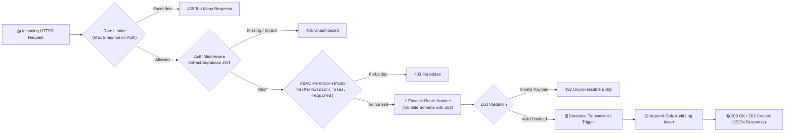

# FORENZA — REST API Reference & Integration Guide

> Complete specification of all Next.js 15 App Router endpoints, RBAC permissions, and request/response payloads.

---

## 1. API Architecture & Security Model



---

## 2. Authentication Endpoints

### `POST /api/auth/login`
Authenticates an officer and binds the session to an approved hardware device.
- **Access**: Public
- **Request Body**:
  ```json
  {
    "email": "officer@forenza.gov",
    "password": "SecurePassword123!",
    "device_identifier": "web_9a4f8812c44e991b",
    "device_name": "Field iPhone 15 Pro",
    "platform": "ios"
  }
  ```
- **Responses**:
  - `200 OK`: `{ "user": { "id": "...", "roles": ["INVESTIGATING_OFFICER"] }, "session": {...}, "mfa_required": false }`
  - `403 Forbidden`: `{ "error": "Device pending administrator approval", "device_status": "PENDING" }`

### `POST /api/auth/logout`
Terminates user session and invalidates active authentication tokens.
- **Access**: Authenticated

---

## 3. Evidence Endpoints

### `POST /api/evidence`
Registers a new evidence item under an active case.
- **Permission**: `evidence:create`
- **Request Body**:
  ```json
  {
    "case_id": "550e8400-e29b-41d4-a716-446655440001",
    "evidence_number": "EVD-2024-0089",
    "description": "Tactical Fixed Blade Knife found near perimeter."
  }
  ```

### `POST /api/evidence/:id/capture`
Submits geotagged field media, verifies geofence perimeter, and records genesis custody node.
- **Permission**: `evidence:capture`
- **Request Body**:
  ```json
  {
    "latitude": 40.7132,
    "longitude": -74.0055,
    "gps_accuracy": 3.4,
    "media_type": "PHOTO",
    "mime_type": "image/jpeg",
    "file_sha256": "8f498a7d...391a",
    "file_size_bytes": 2048576,
    "storage_path": "cases/CASE-041/evidence/EVD-0089.jpg"
  }
  ```

### `POST /api/evidence/:id/seal`
Applies canonical SHA-256 master hash and generates signed 24h QR evidence tag.
- **Permission**: `evidence:seal`
- **Response `200 OK`**:
  ```json
  {
    "success": true,
    "master_hash": "e3b0c44298fc1c149afbf4c8996fb92427ae41e4649b934ca495991b7852b855",
    "qr_token": "eyJhbGciOiJIUzI1NiIsInR5cCI6IkpXVCJ9...",
    "sealed_at": "2024-01-15T09:17:00.000Z"
  }
  ```

### `POST /api/evidence/:id/verify`
Runs all 4 cryptographic integrity checks (Master Hash, Custody Chain, Media Bytes, Lab Reports).
- **Permission**: `evidence:verify`
- **Response `200 OK` (Intact)**:
  ```json
  {
    "overall_status": "INTEGRITY_VERIFIED",
    "master_hash": { "status": "INTEGRITY_VERIFIED", "match": true },
    "custody_chain": { "status": "VERIFIED", "total_events": 7 },
    "media_hash": { "status": "INTEGRITY_VERIFIED" },
    "verified_at": "2024-01-15T11:30:00.000Z"
  }
  ```

---

## 4. Custody & Vault Endpoints

### `POST /api/evidence/:id/transfer`
Generates a signed single-use handover JWT token (15-minute TTL).
- **Permission**: `custody:transfer`

### `POST /api/evidence/:id/receive`
Scans and validates a handover token, updates `current_holder_id`, and extends the custody hash chain.
- **Permission**: `custody:receive`

### `POST /api/evidence/:id/vault`
Assigns physical vault rack/shelf/bin storage and updates status to `VAULT_STORED`.
- **Permission**: `vault:receive`
- **Request Body**:
  ```json
  {
    "vault_id": "VAULT-01",
    "rack": "RACK-B",
    "shelf": "SHELF-04",
    "bin": "BIN-12",
    "notes": "Secured in cold storage evidence locker."
  }
  ```

---

## 5. Transit Telemetry Endpoints

### `POST /api/evidence/:id/telemetry`
Streams GPS transit breadcrumbs while evidence is `IN_TRANSIT`.
- **Security Notice**: Unauthorized requests automatically receive a `200 OK` decoy response to avoid leaking evidence state to potential interceptors.
