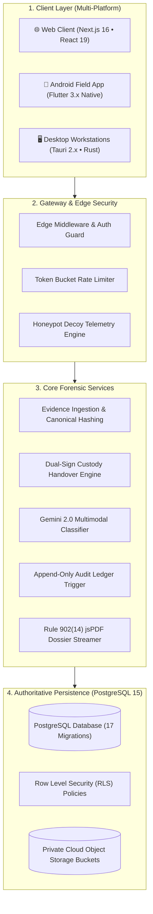
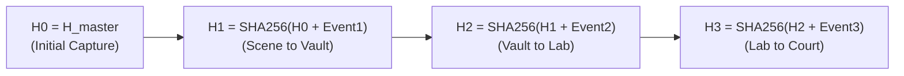
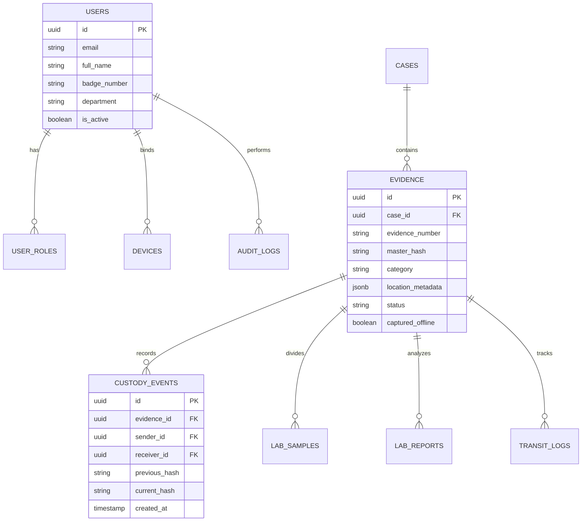

# 🏛️ FORENZA — Master System Architecture Document
### Enterprise Digital & Physical Evidence Chain-of-Custody Infrastructure

---

## 1. Architectural Philosophy

FORENZA is architected as a **Zero-Trust, Append-Only Cryptographic Evidence Ledger**. Every interaction—from crime-scene photon capture to judicial dossier review—is recorded into an immutable, mathematically verifiable state chain.

---

## 2. Cryptographic Master Hashing & Hash-Chaining

### 2.1 Canonical Evidence Hashing
To prevent single-bit alterations across varying JSON serializers, evidence metadata is normalized into canonical lexicographical key-value pairs before SHA-256 computation:

$$\text{CanonicalString} = \text{EvidenceID} + "|" + \text{CaseID} + "|" + \text{OfficerID} + "|" + \text{Latitude} + "|" + \text{Longitude} + "|" + \text{Timestamp}_{\text{UTC}}$$

$$H_{\text{master}} = \text{SHA-256}\Big(\text{RawMediaBytes} + \text{CanonicalString}\Big)$$

### 2.2 Custody Block Chaining
Custody events form an append-only cryptographic linked chain:

---

## 3. Database Entity-Relationship Overview

---

© 2026 FORENZA Enterprise Forensics.
