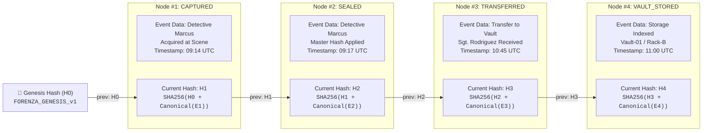
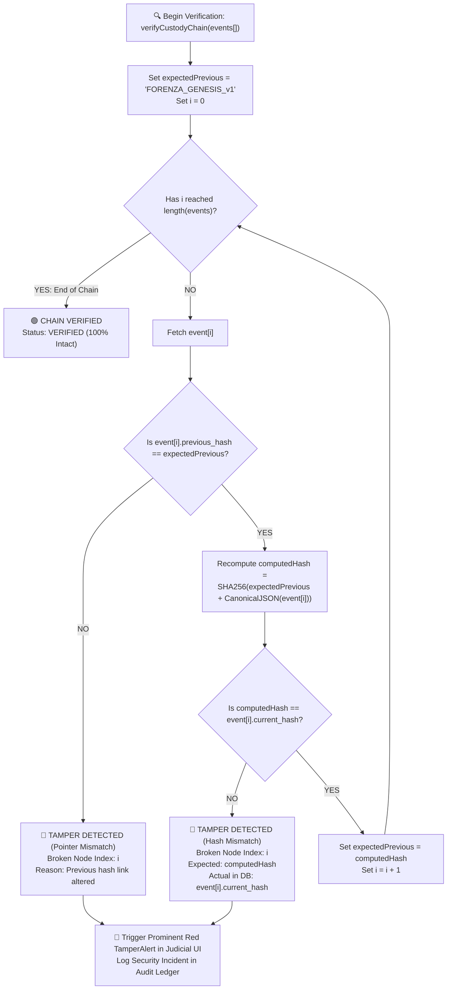

# FORENZA — Cryptographic Integrity & Chain-of-Custody Specification

> Mathematical formulation, canonical serialization protocol, SHA-256 hash chaining, and tamper detection verification algorithm under Federal Rules of Evidence Rule 902(14).

---

## 1. Cryptographic Principles

FORENZA uses deterministic, mathematically verifiable algorithms to prove:
1. **Evidence Integrity**: Physical and digital media have not been altered since acquisition.
2. **Custody Authenticity**: Every handover is an append-only cryptographic event linked to the prior custodian.
3. **Temporal & Spatial Proof**: Evidence acquisition timestamp and GPS coordinates are immutably sealed into the master hash.
4. **Zero-Trust Verifiability**: Any third party (defense counsel, judge, independent auditor) can recompute all hashes from canonical JSON records without proprietary software.

---

## 2. Canonical JSON Serialization Protocol

Standard JSON serialization does not guarantee key ordering or numeric formatting across different programming languages (TypeScript, Python, Dart). FORENZA enforces strict **Canonical JSON Serialization**:

1. All dictionary keys are sorted in ascending ASCII alphabetical order (`.sort()`).
2. Floating-point numbers maintain standard IEEE 754 precision without trailing zeroes.
3. Timestamps are formatted as ISO 8601 UTC strings with millisecond precision: `YYYY-MM-DDTHH:mm:ss.sssZ`.
4. `null` or `undefined` values are canonicalized to `null`.
5. UTF-8 byte encoding is applied prior to hashing.

---

## 3. Evidence Master Hash Formula

The Master Hash is computed at the moment of evidence sealing:

$$\text{Master Hash} = \text{SHA-256}\left(\text{CanonicalJSON}\left(\mathbf{E}\right)\right)$$

Where the canonical dictionary $\mathbf{E}$ contains:

```json
{
  "algorithm": "FORENZA_EVIDENCE_HASH_v1",
  "case_id": "550e8400-e29b-41d4-a716-446655440001",
  "evidence_id": "550e8400-e29b-41d4-a716-446655440000",
  "evidence_number": "EVD-2024-0089",
  "file_size_bytes": 2048576,
  "gps_accuracy": 3.4,
  "latitude": 40.7132,
  "longitude": -74.0055,
  "media_sha256": "8f498a7d...391a",
  "media_type": "PHOTO",
  "mime_type": "image/jpeg",
  "officer_id": "550e8400-e29b-41d4-a716-446655440002",
  "timestamp_utc": "2024-01-15T09:14:22.000Z"
}
```

---

## 4. Blockchain-Style Custody Hash Chain

Each custody event forms an immutable linked node in the evidence hash chain:

$$\mathbf{H}_0 = \text{"FORENZA\_GENESIS\_v1"}$$

$$\mathbf{H}_i = \text{SHA-256}\left(\mathbf{H}_{i-1} + \text{CanonicalJSON}\left(\mathbf{C}_i\right)\right) \quad \text{for } i \ge 1$$



---

## 5. Tamper Detection Algorithm

When an auditor or judge initiates an integrity check, the engine sequentially recomputes every node in the chain:



---

## 6. Token Cryptography (QR & Handover)

| Token Type | Purpose | Payload | Expiration (TTL) | Algorithm | Storage Policy |
|---|---|---|---|---|---|
| **Evidence QR Tag** | Digital identifier on physical evidence packaging | `{sub: evidence_id, jti: token_id, type: "EVIDENCE_QR"}` | 24 Hours (Renewable) | HS256 (Secret Key) | Only SHA-256 hash of token stored in DB |
| **Custody Handover Token** | Single-use physical transfer token | `{sub: evidence_id, sender: user_id, type: "CUSTODY_HANDOVER"}` | 15 Minutes (Strict) | HS256 (Secret Key) | Invalidated immediately upon receiver scan (`used = TRUE`) |
