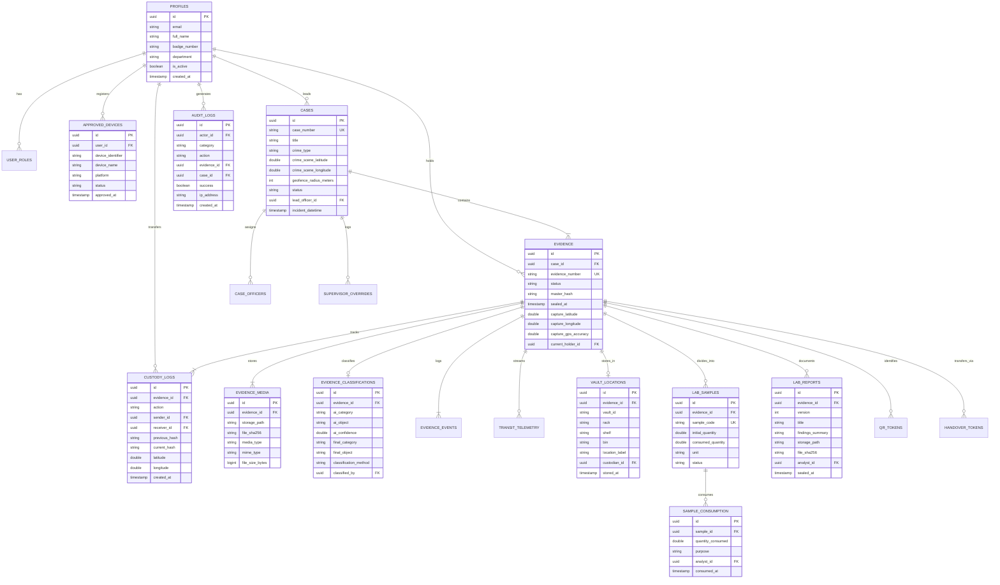

# FORENZA — Database Schema & Entity Relationship Model

> PostgreSQL 15+ relational schema, composite performance indexes, append-only triggers, and Row-Level Security (RLS) policies.

---

## 1. Entity-Relationship Diagram (ERD)

---

## 2. Table Catalog & Foreign Keys

| Table Name | Description | Key Indexes | Immutability Trigger |
|---|---|---|---|
| `profiles` | User accounts and officer credentials | `id`, `email`, `badge_number` | None |
| `approved_devices` | Hardware device token registry | `(user_id, device_identifier)` | None |
| `cases` | Criminal investigation cases | `case_number`, `status`, `lead_officer_id` | None |
| `evidence` | Primary forensic evidence records | `evidence_number`, `case_id`, `status`, `master_hash` | `protect_master_hash` |
| `evidence_media` | Image, video, and audio file hashes | `evidence_id`, `file_sha256` | `prevent_media_tampering` |
| `evidence_classifications` | AI inference vs human confirmation | `evidence_id`, `classified_by` | Immutable after insert |
| `custody_logs` | Append-only custody hash chain | `evidence_id`, `current_hash`, `created_at` | `prevent_audit_modification` |
| `evidence_events` | Granular audit event timeline | `evidence_id`, `event_type`, `created_at` | `prevent_audit_modification` |
| `transit_telemetry` | GPS transit route breadcrumbs | `evidence_id`, `recorded_at` | Append-only |
| `vault_locations` | Physical storage indexing (Vault/Rack/Shelf/Bin) | `evidence_id`, `vault_id` | None |
| `lab_samples` | Divided physical sample quantities | `evidence_id`, `sample_code` | `validate_sample_consumption` |
| `sample_consumption` | Sample depletion logging | `sample_id`, `consumed_at` | Append-only |
| `lab_reports` | Certified scientific PDF findings | `evidence_id`, `file_sha256` | Immutable after sealing |
| `audit_logs` | System-wide security audit ledger | `actor_id`, `category`, `created_at` | `prevent_audit_modification` |
| `supervisor_overrides` | Geofence exception approvals/rejections | `evidence_id`, `supervisor_id` | Immutable decision log |
