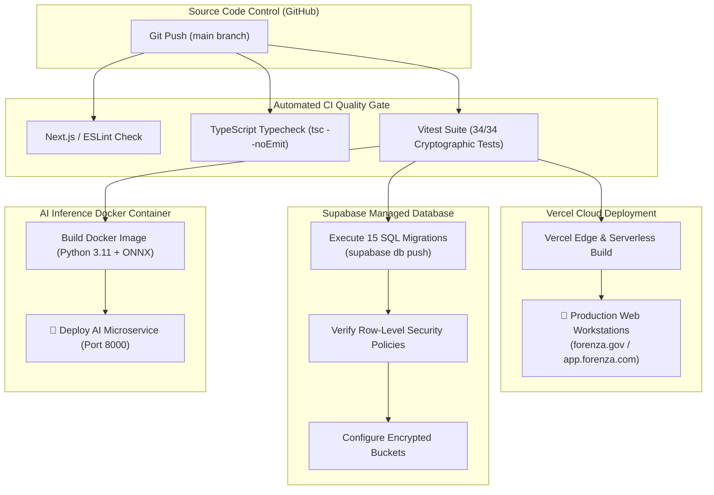

# FORENZA — Production Deployment & Operations Runbook

> Deployment guide, Supabase database migration execution, FastAPI containerization, environment secrets, and key rotation procedures.

---

## 1. CI/CD & Deployment Pipeline



---

## 2. Environment Variables Specification

Ensure all variables in `.env.example` are populated in your deployment environment:

```env
# --- Supabase Configuration ---
NEXT_PUBLIC_SUPABASE_URL="https://your-project.supabase.co"
NEXT_PUBLIC_SUPABASE_ANON_KEY="eyJhbGciOiJIUzI1NiIsInR5cCI6IkpXVCJ9..."
SUPABASE_SERVICE_ROLE_KEY="eyJhbGciOiJIUzI1NiIsInR5cCI6IkpXVCJ9..."

# --- Cryptographic & JWT Secrets ---
FORENZA_QR_JWT_SECRET="generate-a-64-character-random-hex-string-for-qr-signing"
FORENZA_HANDOVER_JWT_SECRET="generate-a-64-character-random-hex-string-for-handover-signing"

# --- AI Microservice Configuration ---
FORENZA_AI_SERVICE_URL="http://localhost:8000"
FORENZA_AI_SERVICE_API_KEY="forenza-ai-internal-service-key"
```

---

## 3. Database Migration Execution

To push all 15 migrations to your Supabase instance:

```bash
# 1. Login to Supabase CLI
supabase login

# 2. Link your local project to your remote Supabase cloud project
supabase link --project-ref <your-project-id>

# 3. Apply all 15 migrations in sequential order
supabase db push
```

---

## 4. AI Microservice Container Deployment

To build and run the FastAPI AI Classifier via Docker:

```bash
# 1. Build the Docker container
cd ai-service
docker build -t forenza-ai-service:latest .

# 2. Run the container on port 8000
docker run -d \
  -p 8000:8000 \
  --name forenza-ai \
  --restart always \
  -e FORENZA_AI_API_KEY="forenza-ai-internal-service-key" \
  forenza-ai-service:latest
```

---

## 5. Security & Disaster Recovery Procedures

1. **Daily Immutable Backups**: Point-in-time recovery (PITR) enabled on PostgreSQL instance with 30-day retention.
2. **Key Rotation Protocol**:
   - Rotate `FORENZA_QR_JWT_SECRET` and `FORENZA_HANDOVER_JWT_SECRET` every 90 days.
   - Master evidence SHA-256 hashes are independent of JWT secrets and remain valid forever.
3. **Emergency Device Revocation**: In the event of a lost/compromised officer device, invoke `PATCH /api/auth/device/:id` to set `status = 'REVOKED'` immediately terminating all active sessions.
