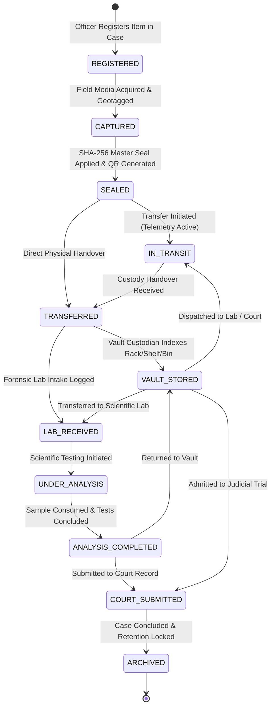
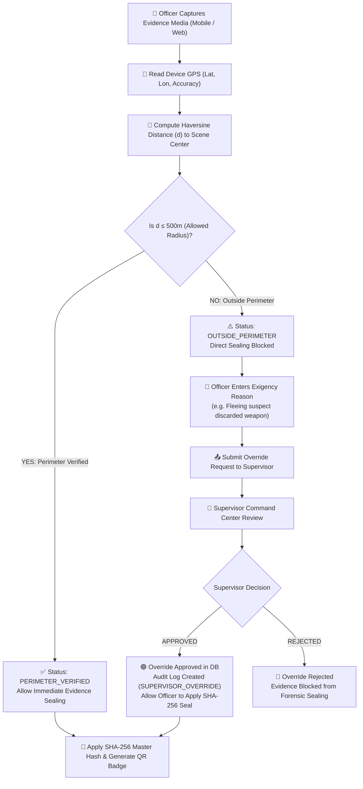
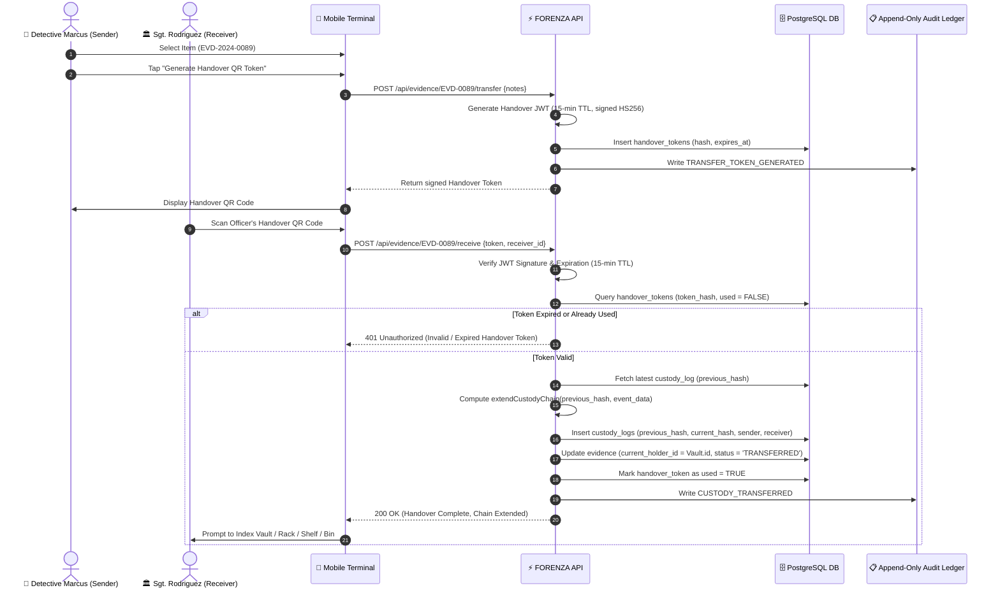

# FORENZA — Forensic Evidence Lifecycle & State Machine

> Comprehensive specification of forensic evidence state transitions, geofence verification, supervisory overrides, and laboratory custody tracking.

---

## 1. Evidence State Machine

FORENZA enforces an explicit, deterministic state machine at both the application API layer and via PostgreSQL database triggers (`validate_evidence_transition`). Any state jump outside the allowed directed graph is rejected with a `409 Conflict` database exception.

---

## 2. State Transition Matrix & Permissions

| Current State | Allowed Next States | Required RBAC Permission | Key Pre-Conditions |
|---|---|---|---|
| `REGISTERED` | `CAPTURED` | `evidence:capture` | Case is `ACTIVE`; Officer assigned. |
| `CAPTURED` | `SEALED` | `evidence:seal` | Primary media SHA-256 computed; GPS coordinates within perimeter or override approved. |
| `SEALED` | `IN_TRANSIT`, `TRANSFERRED` | `custody:transfer` | Single-use Handover JWT generated (15-min TTL). |
| `IN_TRANSIT` | `TRANSFERRED`, `VAULT_STORED` | `custody:receive` | Receiver scans and validates handover token; GPS telemetry stopped. |
| `TRANSFERRED` | `VAULT_STORED`, `LAB_RECEIVED` | `vault:receive` / `lab:receive` | Custodian confirms physical item receipt and condition. |
| `VAULT_STORED` | `IN_TRANSIT`, `LAB_RECEIVED`, `COURT_SUBMITTED` | `vault:dispatch` | Dispatch authorized by Case Lead or Supervisor. |
| `LAB_RECEIVED` | `UNDER_ANALYSIS` | `lab:analyze` | Sample registered with initial quantity balance. |
| `UNDER_ANALYSIS` | `ANALYSIS_COMPLETED` | `lab:report` | Certified laboratory PDF report uploaded and SHA-256 sealed. |
| `ANALYSIS_COMPLETED` | `VAULT_STORED`, `COURT_SUBMITTED` | `custody:transfer` | Remaining sample balance reconciled in audit log. |
| `COURT_SUBMITTED` | `ARCHIVED` | `evidence:archive` | Judicial verdict entered; retention period locked. |

---

## 3. Geofence Verification & Supervisor Override Flow

When evidence is captured in the field, its coordinates are compared against the authorized crime scene origin using the **Haversine formula**.

---

## 4. Custody Handover & Chain Extension Sequence

