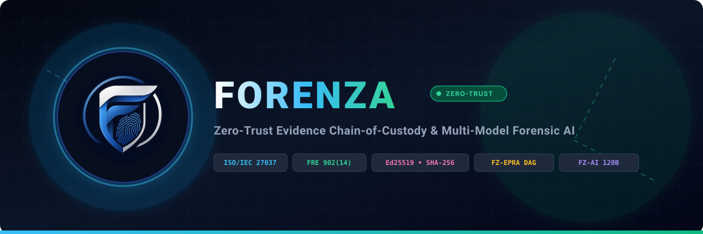

  
    
  
    
  <h1>📚 FORENZA — Master Documentation Index</h1>
  
<b>Creator & Intellectual Property Owner:</b> Timon Biswas (<code>timonbiswas33@gmail.com</code>)

  
<b>Standard:</b> ISO/IEC 27037 • NIST SP 800-86 • FRE Rule 902(14)

---

## 🏛️ 1. Architecture & System Design
* [PLATFORM_CAPABILITIES_AND_SECURITY.md](PLATFORM_CAPABILITIES_AND_SECURITY.md) — **Master summary: What FORENZA can do & full security specifications.**
* [REPOSITORY_STRUCTURE.md](REPOSITORY_STRUCTURE.md) — Complete repository tree & component breakdown.
* [SYSTEM_ARCHITECTURE.md](SYSTEM_ARCHITECTURE.md) — High-level architecture, trust boundaries, and network topology.
* [ARCHITECTURE.md](ARCHITECTURE.md) — Core software design patterns and modular breakdown.
* [EVIDENCE_LIFECYCLE.md](EVIDENCE_LIFECYCLE.md) — State machine lifecycle from crime scene capture to judicial disposal.
* [BRANCHING.md](BRANCHING.md) — Non-destructive branching and signed human judicial adjudication.
* [PLATFORM_SUPPORT.md](PLATFORM_SUPPORT.md) — Cross-platform client specifications (Web, Mobile, Desktop).

---

## 🔒 2. Cryptography & Forensic Verification
* [FORENZA_Algorithm_Documentation.md](FORENZA_Algorithm_Documentation.md) — Master mathematical & algorithm specification ([Download DOCX](FORENZA_Algorithm_Documentation.docx) | [Download PDF](FORENZA_Algorithm_Documentation.pdf)).
* [CRYPTOGRAPHIC_SPECIFICATION.md](CRYPTOGRAPHIC_SPECIFICATION.md) — Detailed RFC 8785, SHA-256, and Ed25519 specifications.
* [CRYPTOGRAPHY.md](CRYPTOGRAPHY.md) — Cryptographic key lifecycle and device attestation.
* [EPRA.md](EPRA.md) — Evidence Provenance Reconciliation Algorithm (FZ-EPRA) & FZ-DIV.
* [EVIDENCE_PASSPORT.md](EVIDENCE_PASSPORT.md) — FZ-PASS container format & independent verifier specification.

---

## 🤖 3. FZ-AI Multi-Model Subsystem
* [AI_ARCHITECTURE.md](AI_ARCHITECTURE.md) — Decoupled FZ-AI topology & orchestrator routing.
* [AI_MODELS.md](AI_MODELS.md) — Model responsibility matrix (Groq, Gemini, DeepSeek, Nemotron).
* [AI_LIVE_VERIFICATION.md](AI_LIVE_VERIFICATION.md) — Real API live verification results & latency audit.
* [AI_SECURITY.md](AI_SECURITY.md) — Adversarial prompt injection defense & data minimization.
* [AI_RAG.md](AI_RAG.md) — Case-isolated semantic retrieval & pgvector RAG specifications.
* [AI_PROVENANCE.md](AI_PROVENANCE.md) — Immutable AI run hashing & human review lifecycle.
* [AI_PROVIDER_CONFIGURATION.md](AI_PROVIDER_CONFIGURATION.md) — Provider setup & API keys runbook.
* [AI_IMPLEMENTATION_AUDIT.md](AI_IMPLEMENTATION_AUDIT.md) — Phase-by-phase AI capability audit.

---

## 🛡️ 4. Security, Compliance & Governance
* [THREAT_MODEL.md](THREAT_MODEL.md) — STRIDE threat analysis, attack trees, and mitigations.
* [COMPLIANCE_MAPPING.md](COMPLIANCE_MAPPING.md) — Mapping to ISO/IEC 27037, NIST SP 800-86, and FRE Rule 902(14).
* [PRIVACY.md](PRIVACY.md) — Data protection, pseudonymization, and retention controls.
* [INCIDENT_RESPONSE.md](INCIDENT_RESPONSE.md) — Security incident triage, containment, and forensic recovery.

---

## 🚀 5. Deployment & API Reference
* [DEPLOYMENT_RUNBOOK.md](DEPLOYMENT_RUNBOOK.md) — Vercel, Supabase, and Docker deployment guide.
* [API.md](API.md) — Authoritative REST API endpoint summary.
* [API_REFERENCE.md](API_REFERENCE.md) — Full REST request/response schemas.
* [DATABASE_SCHEMA.md](DATABASE_SCHEMA.md) — 40-table PostgreSQL zero-trust database schema.
* [SETUP.md](SETUP.md) — Local developer environment setup instructions.
* [CURRENT_IMPLEMENTATION_AUDIT.md](CURRENT_IMPLEMENTATION_AUDIT.md) — Comprehensive technical implementation audit.
