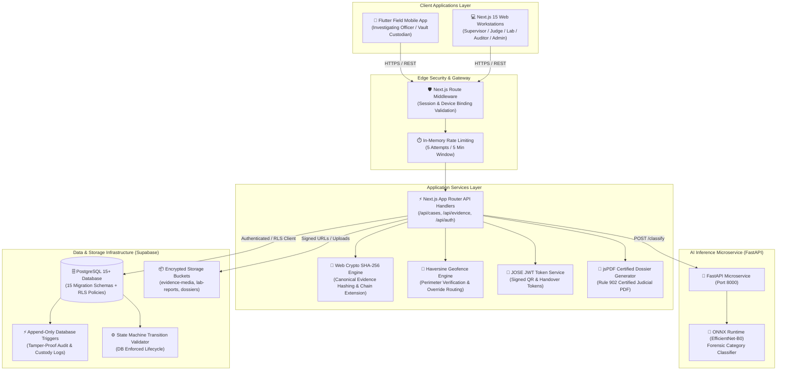
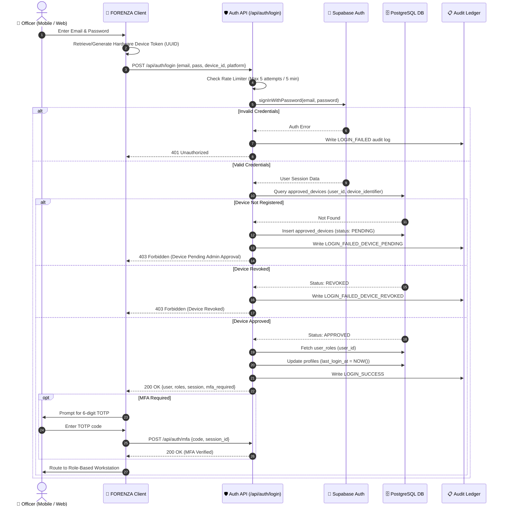

# FORENZA — System Architecture & Technical Specification

> **Trusted Evidence. True Justice.**  
> Enterprise Forensic Evidence Chain of Custody & Tamper-Evident Audit Platform

---

## 1. Executive Summary

**FORENZA** is a forensic security platform engineered to manage the complete lifecycle of physical and digital forensic evidence from crime-scene acquisition under verified GPS geofences to courtroom judicial review under Federal Rules of Evidence Rule 902(14).

The system enforces:
- Strict evidence identity and metadata immutability.
- GPS perimeter verification with Haversine geofence calculation.
- Edge AI-assisted object identification with human-in-the-loop overrides.
- Blockchain-style SHA-256 custody hash chaining.
- Encrypted single-use QR handover tokens.
- Real-time transit telemetry tracking with security decoy responses.
- Laboratory scientific sample depletion control.
- Automated judicial court dossier generation with cryptographic verification.

---

## 2. High-Level System Architecture

---

## 3. Component Breakdown

### 3.1. Web Application (`/web`)
- **Framework**: Next.js 15 (App Router), React 19, TypeScript 5.
- **Styling**: Tailwind CSS v4, custom CSS variable design tokens (`globals.css`), Lucide icons.
- **Design System**: Dual-mode (Obsidian Dark `#0B0F19` and Crisp Light `#F8FAFC`), theme persistence.
- **Role Portals**: Dedicated workstations for 7 distinct roles:
  1. *Investigating Officer* (`/officer/*`)
  2. *Supervisor Command* (`/supervisor/*`)
  3. *Central Evidence Vault* (`/vault/*`)
  4. *Forensic Laboratory* (`/lab/*`)
  5. *Judicial Chamber & Trial* (`/judge/*`)
  6. *Master Forensic Auditor* (`/auditor/*`)
  7. *System Administration* (`/admin/*`)

### 3.2. Mobile Application (`/mobile`)
- **Framework**: Flutter / Dart (Riverpod 2.5, GoRouter 14).
- **Hardware Integration**: Camera viewfinder HUD, Geolocator GPS, MobileScanner QR reader, QrFlutter generator.
- **Field UX**: Large touch targets, one-handed operation, dark mode field optimization, offline resilience.

### 3.3. AI Microservice (`/ai-service`)
- **Framework**: FastAPI (Python 3.11), Pydantic v2, ONNX Runtime.
- **Model**: Pre-trained EfficientNet-B0 fine-tuned for forensic categories (Weapons, Biological, Documents, Electronics, Substances, Trace).
- **Resilience**: Automatic fallback to graceful stub inference if ONNX weights are unmounted.

### 3.4. Supabase Database & Security Layer
- **PostgreSQL 15**: 15 migration scripts covering 14 tables with composite, GIN, and partial indexes.
- **Row-Level Security (RLS)**: Fine-grained declarative policies enforcing least-privilege data access per role.
- **Trigger-Level Security**:
  - `prevent_audit_modification`: Blocks `UPDATE` and `DELETE` on audit and custody logs.
  - `protect_master_hash`: Rejects alterations to sealed evidence hashes.
  - `validate_sample_consumption`: Prevents laboratory sample over-consumption.
  - `enforce_evidence_state_machine`: Rejects illegal state jumps.

---

## 4. Authentication & Hardware Device Binding Sequence

