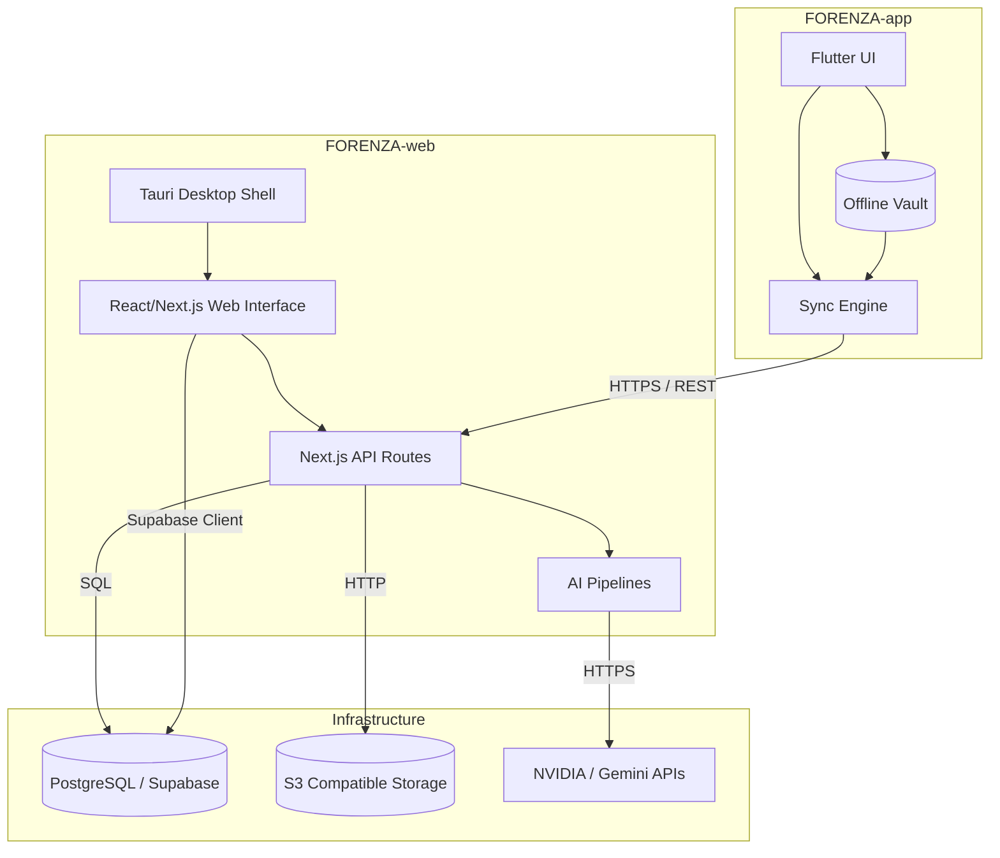

# FORENZA System Architecture

## Core Philosophy
FORENZA is a unified platform separated into a **Field Operations Client** (Android App) and a **Central Intelligence & Command Platform** (Web App + Backend). 

## System Architecture Diagram

## Interconnectivity
- **Database Sharing:** Both clients interface with the same Supabase project. The web app uses SSR and API routes for heavy processing, while the mobile app connects via its Sync Engine.
- **Feature Parity:** 
  - *Android* is optimized for **capture, speed, and offline capability**.
  - *Web* is optimized for **analysis, audits, long-term case management, and judicial dossiers**.
