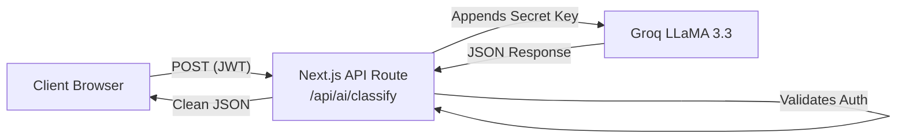

# FORENZA-web AI Architecture & Limitations

## AI Proxy Pattern
The web application uses an API route (`/api/ai/classify`) to act as a secure proxy between the authenticated client and the external LLM provider (Groq/NVIDIA).

## Security & Usage Limits
- **Key Protection:** The `GROQ_API_KEY` never touches the browser.
- **Data Minimization:** Only textual descriptions and extracted metadata are sent to the LLM. Raw binary evidence (videos/images) is **NOT** sent to external text LLMs to prevent data leakage of sensitive crime scene media.

## ⚠️ AI Limitations (Honesty Declaration)
1. **No Legal Authority:** AI classifications are suggestions. The `classification_method` column distinguishes between `AI_CONFIRMED` and `MANUAL`.
2. **Hallucination Risk:** LLMs may invent categories. The frontend enforces strict TypeScript schema validation (via Zod) on the JSON returned by the AI before displaying it.
3. **Not Air-Gapped:** Currently relies on cloud Groq. True air-gapped deployments would require a local NVIDIA NIM server on the same physical network.
