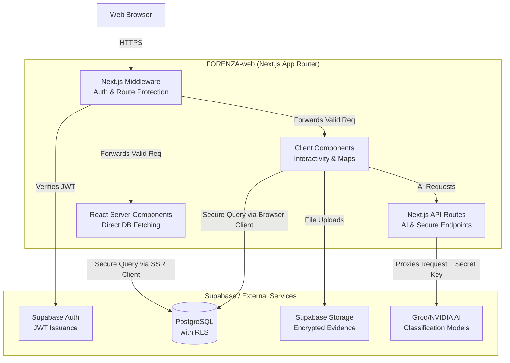

# FORENZA-web Architecture

## Architectural Overview
The FORENZA Web Application utilizes a Serverless React architecture via Next.js (App Router). It delegates absolute authority for data persistence, real-time sync, and Row Level Security (RLS) to Supabase.

## Key Architectural Decisions
1. **Server-Side Rendering (SSR) Default:** Data fetching heavily relies on RSCs in `page.tsx` files. This ensures evidence metadata is fetched securely on the server before rendering, preventing sensitive data from bleeding into the client bundle.
2. **Middleware Route Protection:** `middleware.ts` is the gatekeeper. It intercepts all requests, extracts the JWT, fetches the user profile, and compares the user's `AppRole` against the `ROUTE_ROLES` mapping.
3. **AI Proxy Pattern:** The client never talks to Groq directly. It sends requests to `/api/ai/*`, which attaches the `GROQ_API_KEY` and forwards the request, protecting the secret.
