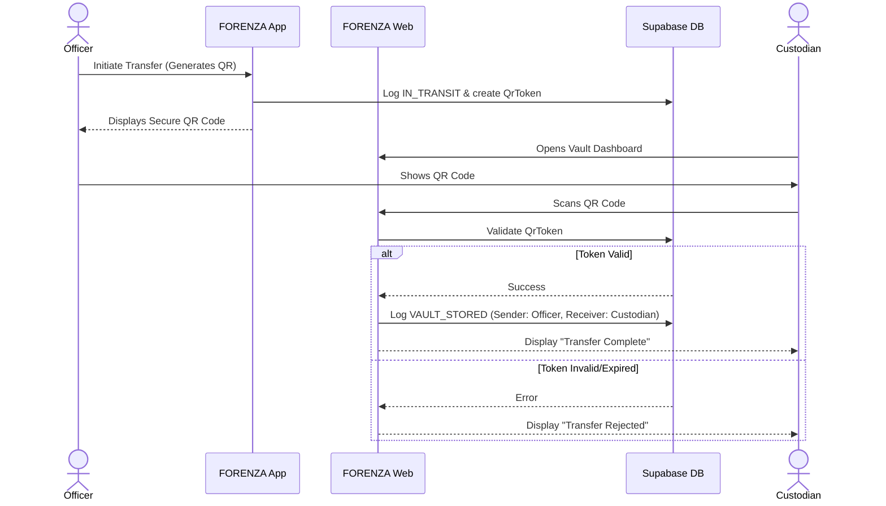

# FORENZA-web Chain of Custody

The Chain of Custody (CoC) is the most critical forensic element of the platform. The web application visualizes the sequential log of custody events recorded in the Supabase backend.

## Transfer Sequence

## Data Rendered in UI
When rendering the Custody Log table, the Web Application joins the `custody_logs` table with the `profiles` table to resolve `sender_id` and `receiver_id` into human-readable badge numbers and names, ensuring auditors can instantly identify personnel.
