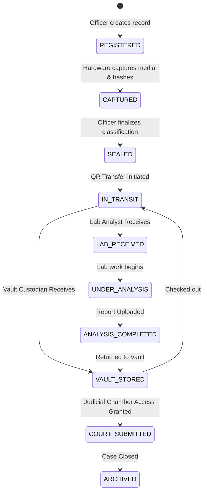

# FORENZA-web Evidence Workflow

This document illustrates the complete lifecycle of evidence as handled by the FORENZA Web Application.

## Evidence Lifecycle State Machine

## Workflow Constraints
1. **Irreversible Hashing:** Once the state moves to `CAPTURED`, the `master_hash` and `file_sha256` are permanently locked.
2. **Strict Handoffs:** Evidence cannot jump from `SEALED` to `LAB_RECEIVED` without a logged `IN_TRANSIT` event to preserve the Chain of Custody.
