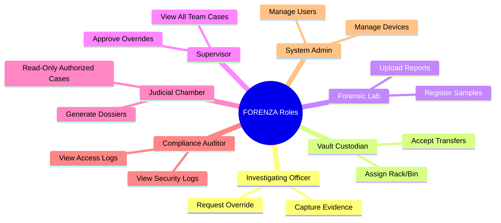

# FORENZA-web RBAC Permission Matrix

This document defines the strict Role-Based Access Control (RBAC) matrix for the web platform, reconciling frontend routing permissions (`lib/rbac.ts`) with backend capabilities.

> [!IMPORTANT]
> The frontend UI only hides elements. True security is enforced by the Supabase PostgreSQL Row Level Security (RLS) policies.

## Role Definitions

## Module Access Matrix

| Module | Officer | Custodian | Lab | Supervisor | Judicial | Auditor | Admin |
|--------|---------|-----------|-----|------------|----------|---------|-------|
| **Dashboard** | ✓ | ✓ | ✓ | ✓ | ✓ | ✓ | ✓ |
| **Active Cases** | Assigned Only | Limited View | Assigned Only | ✓ | Authorized | Audit View | ✓ |
| **Evidence Metadata** | ✓ | ✓ | ✓ | ✓ | Authorized | Audit View | Controlled |
| **Evidence Media** | ✓ | ✓ | ✓ | ✓ | Authorized | Audit View | Controlled |
| **Capture Evidence** | ✓ | ❌ | ❌ | ❌ | ❌ | ❌ | ❌ |
| **Chain of Custody** | Transfer | Receive | Receive | View | View | View | View |
| **Lab Reports** | View | ❌ | Create/Edit | View | View | View | ❌ |
| **Audit Logs** | Self-Only | Self-Only | Self-Only | View | ❌ | ✓ | ✓ |
| **System Settings** | ❌ | ❌ | ❌ | ❌ | ❌ | ❌ | ✓ |

## Implementation Nuances

### 1. Supervisor Overrides
If an officer needs to capture evidence outside of a geofenced crime scene, they must request a `SUPERVISOR_OVERRIDE`. The Supervisor role has the exclusive `override:approve` permission to authorize this action.

### 2. Judicial Scope
The Judicial Chamber role (`JUDGE`) operates strictly on a whitelist basis. They can only access evidence marked as `COURT_SUBMITTED` or cases explicitly granted `judicial:read_case` access. They cannot access ongoing investigations.

### 3. Administrative Restraints
The System Administrator (`ADMIN`) role manages users and devices but is **not** a super-user for forensic data. Administrators cannot unilaterally alter evidence hashes or edit lab reports. They manage the platform, not the data.
