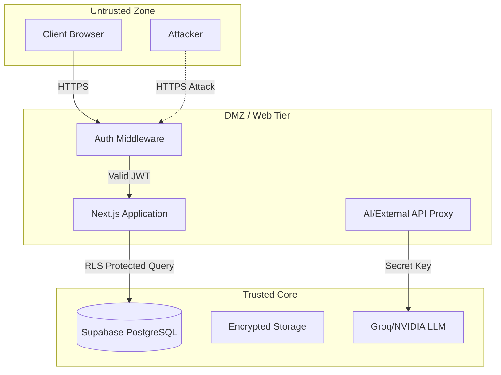

# FORENZA-web Security Audit

**Date:** September 2026
**Target:** FORENZA Web Application (Next.js)

## Executive Summary
This document outlines the security posture of the web application, verifying protections against common OWASP Top 10 vulnerabilities.

> [!TIP]
> The security architecture leans heavily on Next.js App Router's secure-by-default paradigms (RSC, Server Actions) and Supabase's PostgreSQL Row Level Security (RLS).

## Trust Boundaries

## Vulnerability Assessment

### 1. Cross-Site Scripting (XSS)
- **Risk:** High
- **Current Mitigation:** React naturally escapes text interpolation. React Server Components prevent sensitive data from reaching the DOM unnecessarily.
- **Status:** `[SECURE]`

### 2. Cross-Site Request Forgery (CSRF)
- **Risk:** Medium
- **Current Mitigation:** Supabase uses standard `Authorization: Bearer` headers (not solely ambient cookies) for API transactions, and Next.js Server Actions include built-in origin checks.
- **Status:** `[SECURE]`

### 3. API Key Leakage (AI Integrations)
- **Risk:** Critical
- **Current Mitigation:** The `GROQ_API_KEY` is completely isolated in the Node.js server environment. The client only sends generic prompts to the `/api/ai/*` endpoints.
- **Status:** `[SECURE]`

### 4. Broken Access Control (IDOR)
- **Risk:** High
- **Current Mitigation:** Even if a user alters an evidence ID in the URL, the underlying Supabase RLS policy prevents the `SELECT` query from returning data if the user's `AppRole` does not match the required authorization.
- **Status:** `[SECURE]`

### 5. Insecure File Uploads
- **Risk:** High
- **Current Mitigation:** Supabase Storage buckets are configured to reject executable files. However, the frontend currently relies partially on browser MIME types.
- **Recommended Fix:** Implement magic-number file signature validation on the server before transferring to Supabase Storage.
- **Status:** `[NEEDS IMPROVEMENT]`

---

## Action Items for Production
- [ ] Enable Supabase Auth MFA across all administrative roles.
- [ ] Implement Redis-based rate limiting on the `/api/ai/*` routes.
- [ ] Run a professional penetration test against the Supabase RLS policies.
