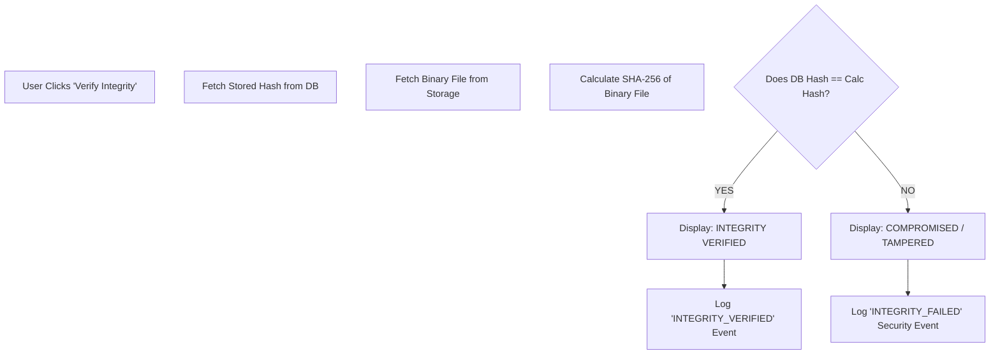

# FORENZA-web Verification Center

The Verification Center allows Judges and Auditors to cryptographically verify the integrity of evidence stored in the system.

## Verification Logic

## Frontend Display
The UI strictly uses Red (`bg-red-500`) for failures and Green (`bg-green-500`) for successes. If the `INTEGRITY_FAILED` event is triggered, the evidence is visually quarantined on the dashboard.
