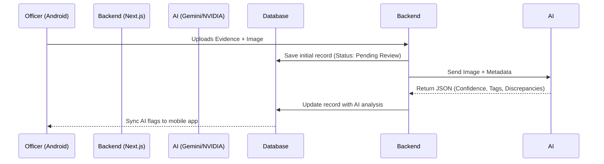

# FORENZA Web AI Integration

## Intelligence Capabilities
FORENZA implements an abstraction layer in `lib/ai/` that allows switching between multiple AI providers for forensic analysis.

### [IMPLEMENTED] AI Pipeline Architecture
- **Orchestrator:** `lib/ai/orchestrator.ts` delegates tasks to specific pipelines based on the operation required.
- **Providers:**
  - `nvidia.ts`: Integration with NVIDIA NIM for specialized/local reasoning.
  - `gemini.ts`: Integration with Google Gemini for fast multimodal analysis (image inspection).
- **Pipelines:**
  - `evidence-image-pipeline.ts`: Extracts text (OCR), identifies objects, and flags inconsistencies between an officer's manual description and the actual image contents.
  - `custody-discrepancy-pipeline.ts`: Analyzes timeline logs to detect impossible travel times (e.g., an evidence bag transferred 500 miles away in 5 minutes).

### [PARTIAL] Local / Air-Gapped AI
The codebase has configurations in `.env.example` for local ONNX models (`AI_MODEL_PATH`), but the primary implemented logic heavily relies on external API calls to Gemini/NVIDIA. True disconnected inference on the backend requires spinning up the NVIDIA NIM server locally.

### AI Data Flow

## Security & Privacy
- Evidence passed to the AI is strictly bounded by `AI_TIMEOUT_MS` and `AI_MAX_REQUEST_SIZE`.
- Responses are sanitized using strictly typed JSON schemas (e.g., Zod) before being written to the database.
