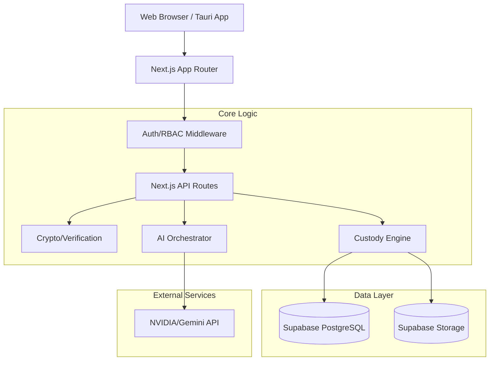

# FORENZA Web Architecture

## Overview
FORENZA-web is the central command platform built on Next.js. It acts as the backend orchestrator, the intelligence platform (AI), the web portal for administrators and auditors, and the host for the Supabase infrastructure.

## Technology Stack
- **Framework:** Next.js (App Router)
- **Language:** TypeScript
- **Styling:** Tailwind CSS (via `globals.css`)
- **Database:** Supabase (PostgreSQL)
- **AI Processing:** Custom AI Pipeline (Gemini/NVIDIA)
- **Desktop Wrapper:** Tauri (Rust)

## Web Architecture

## Key Components

### 1. App Router (`app/`)
Uses Next.js App Router for strict server-side rendering, layout management, and robust API endpoints. Separation of concerns is maintained with roles (e.g., `app/officer`, `app/judge`, `app/lab`).

### 2. AI Pipelines (`lib/ai/`)
Abstracted providers (`base.ts`, `gemini.ts`, `nvidia.ts`) that orchestrate specific tasks:
- `evidence-image-pipeline.ts`: Analyzes photos.
- `custody-discrepancy-pipeline.ts`: Flags timeline anomalies.

### 3. Cryptography & Custody (`lib/crypto/`, `lib/custody/`)
Handles canonicalization of data, verifying SHA-256 hashes submitted by the Android app, and generating cryptographic signatures for chain-of-custody transfers.
