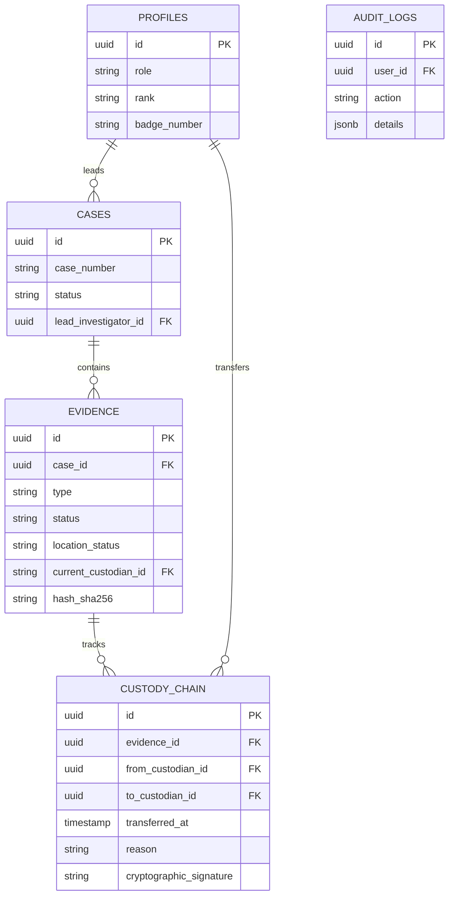

# FORENZA Web Database Architecture

## Overview
FORENZA relies on a robust PostgreSQL database hosted by Supabase. The database enforces strict Relational Row Level Security (RLS) to ensure multi-tenant and role-based data isolation.

## Entity Relationship Diagram

## Security & Policies
- **Row Level Security (RLS):** Enabled on all tables.
- **Profiles:** Only accessible to authenticated users; users can only modify their own data unless they have `admin` privileges.
- **Evidence:** Immutable audit fields. Officers can only update evidence they have physical custody of or if they are assigned to the case.
- **Custody Chain:** Strictly append-only. No user (not even admins) can delete a custody chain record via the API.
