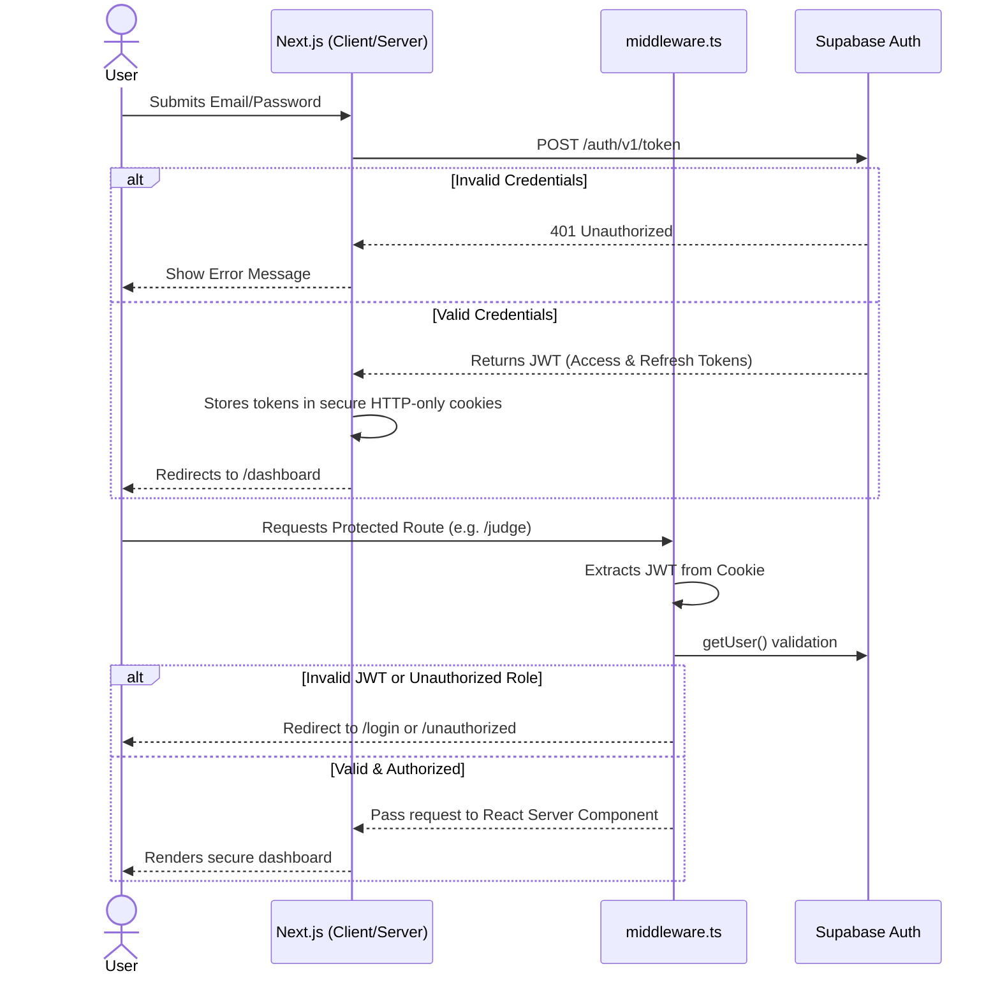

# AUTHENTICATION FLOW

The application relies on Supabase Auth (JWT) integrated with Next.js Middleware.

## Standard Authentication Sequence

## Critical Security Note
The middleware specifically uses `supabase.auth.getUser()` rather than `getSession()`. This ensures the JWT is validated cryptographically against the Supabase backend on every page load, preventing session hijacking or stale token exploitation.
