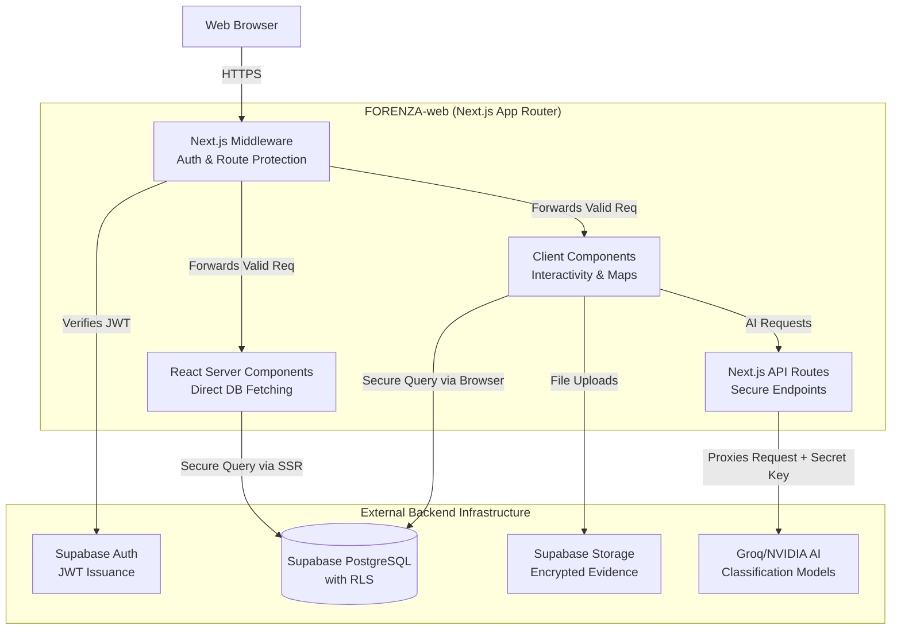

# SYSTEM ARCHITECTURE

## Architectural Overview
The FORENZA Web Application utilizes a Serverless React architecture via Next.js (App Router), delegating absolute authority for data persistence, real-time sync, and Row Level Security (RLS) to Supabase.

## Key Architectural Principles
1. **Server-Side Rendering (SSR) Default:** Data fetching heavily relies on React Server Components (RSCs) in `page.tsx` files. This ensures evidence metadata is fetched securely on the server before rendering, preventing sensitive JSON data from bleeding into the client bundle.
2. **Middleware Gatekeeper:** `middleware.ts` intercepts all requests, extracts the JWT, and enforces 7-role access control mapping based on the configuration in `lib/rbac.ts`.
3. **AI Proxy Pattern:** The client browser never talks to Groq/LLMs directly. It sends requests to `/api/ai/*`, which securely attaches the `GROQ_API_KEY` on the server and forwards the request, protecting the secret.
