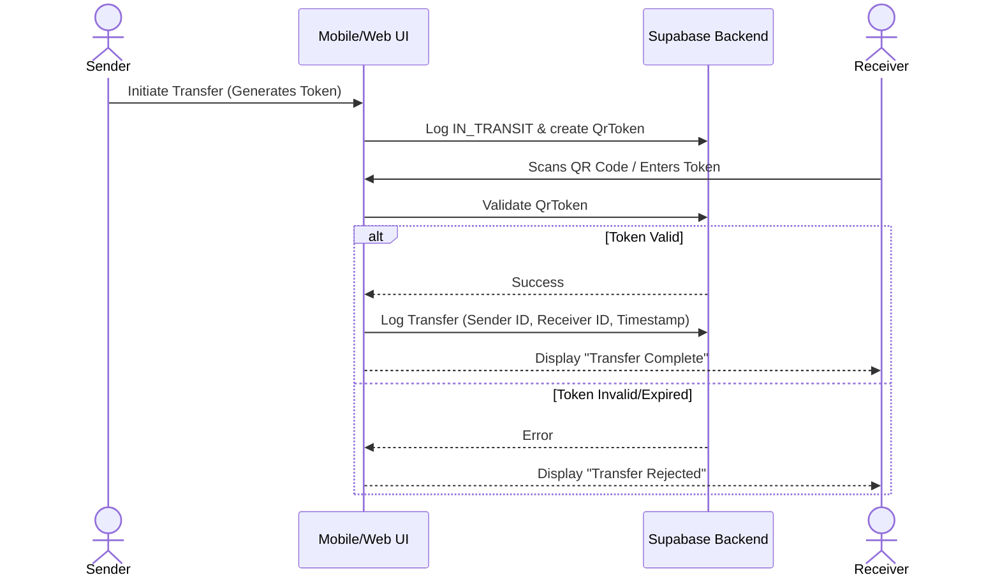

# CHAIN OF CUSTODY

## Purpose
To maintain an immutable, chronologically verifiable log of all physical and digital transfers of evidence.

## Current Status
**IMPLEMENTED (UI & Logging)**

## Technical Flow
The Chain of Custody operates on cryptographic handshakes initiated by the Android Field App and verified by the Web Application.

## Important Files
- `components/forensic/custody-timeline.tsx` (Renders the logs)
- `types/index.ts` (Defines `CustodyLog` schema)

## Security Considerations
The frontend relies on the backend to enforce that the `sender_id` perfectly matches the currently authenticated user's JWT `sub` claim. 
